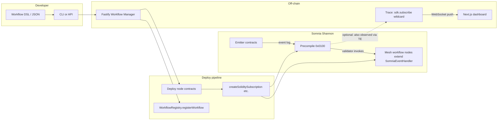

# Mesh

**Mesh** is a reactive workflow engine for teams building on **Somnia**. It targets the official testnet **Shannon** (chain id `50312`, STT gas) and is designed to extend to Somnia mainnet as reactivity matures.

The canonical product specification lives in [`docs/mesh_prd.md`](docs/mesh_prd.md). This README explains what Mesh is, how the pieces fit together, and **which Somnia Reactivity primitives** power each capability.

---

## What problem Mesh solves

Coordinating **Protocol A** when **Protocol B** does something on-chain usually means: off-chain bots, polling RPC nodes, or fragile timing. State you read in a follow-up RPC call may not be from the same context as the event you saw—classic race conditions.

**Somnia Reactivity** narrows that gap: the chain can **push** event logs together with **bundled view calls** (atomic to the notification) over WebSocket, and can **invoke Solidity handlers** when matching logs appear—funded and scheduled through the reactivity precompile.

Mesh is the **developer tooling layer** on top of those primitives: contracts for workflow steps and registry, an HTTP **Workflow Manager** API, a **DSL** with **DAG validation and a v1 compiler** (single `MeshWorkflowExecutor` per workflow), optional **CLI**, a **dashboard** frontend, and a **trace** path fed by wildcard off-chain subscription.

---

## How Mesh works (end-to-end)



1. **Define** a workflow as JSON (DSL): validate, **compile** to an executor plan, or **deploy from definition** (one executor + root subscription + registry). The demo path still deploys fixed demo contracts for quick Shannon tests.
2. **Deploy** per-step contracts that inherit [`SomniaEventHandler`](https://www.npmjs.com/package/@somnia-chain/reactivity-contracts) (Mesh wraps this in [`WorkflowNode`](contracts/src/WorkflowNode.sol)).
3. **Subscribe** each reactive step on-chain with the Reactivity SDK (`createSoliditySubscription`, BlockTick helpers, etc.) so the precompile invokes your handler when filters match.
4. **Register** node addresses + subscription ids in [`WorkflowRegistry`](contracts/src/WorkflowRegistry.sol) for discovery and lifecycle.
5. **Observe** execution: handlers emit `WorkflowStepExecuted` / `WorkflowNoOp`; the backend can open a **wildcard** `sdk.subscribe` and forward pushes to the UI over `/ws/trace`.

---

## Somnia Reactivity ↔ Mesh features

This table mirrors PRD §2 and maps **Somnia’s primitives** to **Mesh components** as implemented or planned.

| Somnia Reactivity capability | Where Mesh uses it | What it enables |
| ---------------------------- | ------------------ | --------------- |
| **`SomniaEventHandler` / `_onEvent`** | [`WorkflowNode`](contracts/src/WorkflowNode.sol), [`MeshEventWorkflowNode`](contracts/src/demo/MeshEventWorkflowNode.sol) | Validator-driven handler code in Solidity when a subscription fires—no bot. |
| **`createSoliditySubscription` (SDK)** | [`deployDemoWorkflow`](backend/src/services/deployDemoWorkflow.ts) | Bind emitter + topic filters to a handler contract; Mesh records returned subscription id on the registry. |
| **`createOnchainBlockTickSubscription`** | [`subscriptionFromTrigger`](backend/src/compiler/subscriptionFromTrigger.ts) (DSL `cron:block`) | Triggers on `BlockTick` system events (every block or specific block). |
| **`scheduleOnchainCronJob`** | [`subscriptionFromTrigger`](backend/src/compiler/subscriptionFromTrigger.ts) (DSL `cron:timestamp`) | One-shot `Schedule` subscription at a future unix **ms** timestamp. |
| **`isGuaranteed: true`**, **`isCoalesced: false`** | Demo deploy (gas via env) | PRD-aligned delivery semantics: retries vs coalescing. |
| **`cancelSoliditySubscription`** | [`workflowLifecycle`](backend/src/services/workflowLifecycle.ts) | Pause/delete: tear down precompile subscriptions before registry state changes. |
| **`getSubscriptionInfo`** | `GET /workflows/:id/subscriptions/:subId` | Subscription health for dashboard / ops. |
| **Off-chain `sdk.subscribe` + `ethCalls`** | Trace engine ([`traceEngine`](backend/src/traceEngine.ts), [`traceBroadcaster`](backend/src/traceBroadcaster.ts)), future condition evaluator | Atomic **event + simulationResults** in one push—conditions without an extra RPC round trip. |
| **`simulationResults[]` decoding** | [`evaluateCondition.ts`](backend/src/evaluateCondition.ts) — uint256 compare + AND/OR **`conditionTree`** | Threshold-style checks off-chain at trigger block; richer decodes still TBD. |
| **System events + precompile emitter** | Shannon docs: `emitter = 0x0100` for `BlockTick` / `Schedule` | Cron-style triggers without an off-chain scheduler. |

**Network:** Shannon testnet overview — [`docs/somnia-reactivity-docs/network-info/network-config.md`](docs/somnia-reactivity-docs/network-info/network-config.md).  
**Gas / fees:** [`docs/somnia-reactivity-docs/gas-config.md`](docs/somnia-reactivity-docs/gas-config.md) — Mesh defaults use `parseGwei` for fee fields; subscription owners need the **minimum native balance** Somnia enforces for reactivity (see [`reactivityBalance`](backend/src/services/reactivityBalance.ts)).

---

## Repository layout

| Path | Role |
| ---- | ---- |
| [`contracts/`](contracts/) | Foundry: `WorkflowRegistry`, `WorkflowNode`, `MeshWorkflowExecutor`, `AuditLog`, Shannon demo (`TriggerEmitter`, `ReactionSink`, `MeshEventWorkflowNode`). |
| [`backend/`](backend/) | Fastify API, Reactivity SDK wiring, deploy/pause/delete, DSL types + DAG validation, workflow index (`data/workflows-index.json`), WebSocket `/ws/trace`, scripts (`e2e:shannon`, `deploy:registry`, `mesh` CLI). |
| [`frontend/`](frontend/) | Next.js dashboard: workflow list, detail + live trace, **visual workflow builder** (`/workflows/build`). |
| [`templates/`](templates/) | Example workflows: linear, `emit`, **hybrid** (`ethCalls` + condition) for `mesh init` / `validate` / `deploy-dsl`. |
| [`docs/`](docs/) | PRD, feasibility, imported Somnia / Foundry docs. |

---

## Implemented today vs roadmap

| Area | Status |
| ---- | ------ |
| Registry + trace base contracts | Done |
| Demo Shannon pipeline (deploy → subscribe → register → ping) | Done (requires funding per Somnia rules) |
| Workflow Manager REST API | Done (`/workflows`, `/chain/*`, `/health`) |
| Pause / delete (cancel subs + registry) | Done |
| Workflow list (indexed file) | Done |
| Wildcard trace WebSocket to browsers | Done (`/ws/trace`) |
| DSL types + DAG validation API | Done (`POST /workflows/validate`, `forCompiler: true` for compiler rules) |
| v1 compiler (executor bytecode + root subscription) | Done — [`MeshWorkflowExecutor`](contracts/src/compiler/MeshWorkflowExecutor.sol), [`compileWorkflow`](backend/src/compiler/compileWorkflow.ts), `POST /workflows/compile`, `POST /workflows/from-definition` |
| CLI `mesh` | Done — includes `validate --compiler`, `compile`, `deploy-dsl` |
| Dashboard | Done — list + detail, stored DSL (compiled deploys), trace decode + **WS `workflowId` filter**, **visual builder** at `/workflows/build` ([`docs/workflow-builder.md`](docs/workflow-builder.md)) |
| `emit` in compiled executor (`LOG1` + `WorkflowStepExecuted`) | Done — [`docs/compiler-emit.md`](docs/compiler-emit.md) |
| **Hybrid** root `ethCalls` + off-chain **`condition` / `conditionTree`** + optional **`evaluationHooks.onPass`** (webhook; raw tx gated) | Done — [`docs/evaluation-engine.md`](docs/evaluation-engine.md), `EVALUATION_ENGINE=1`, index watcher + optional `POST /admin/evaluation/sync`, `WS /ws/evaluation` |
| Per-node deploy (N × `MeshSimpleStepNode` + N subs) | Done — `deployMode: "perNodeFanout"`, CLI `deploy-dsl --fanout`; see [`docs/per-node-deploy.md`](docs/per-node-deploy.md) |

---

## Compiler (v1)

The compiler turns a **validated** [`WorkflowDefinition`](backend/src/dsl/types.ts) into:

1. **`MeshWorkflowExecutor`** — one contract per workflow. Step `0` is the reactive entry (matches the **root** node’s trigger). Each step can **`call`**, **`emit`** an anonymous `LOG1` (standard event `topic0` + payload bytes), or **`noop`**, then branch to child indices. The executor emits `WorkflowStepExecuted` per step (with per-step `stepNodeId` for trace correlation).
2. **One on-chain subscription** on the root trigger only — `event` (emitter + `eventTopic0`), `cron:block` (`BlockTick` via precompile emitter `0x0100`), or `cron:timestamp` (`Schedule`). Fan-out in the graph is **in-contract** (executor branches), not multiple root subscriptions.
3. **Registry** — same `WorkflowRegistry.registerWorkflow` shape as the demo: the indexed `workflowNode` is the **executor** address; `sink` is `0x0` for compiled rows.

**v1 limits** (on-chain): [`validateForCompiler`](backend/src/compiler/validateForCompiler.ts) — single root, reachable DAG, **`emit`**, no `condition` / `ethCalls` *in bytecode* (those fields are **stripped** before compile). **Hybrid:** root-only `ethCalls` + optional `condition` for **off-chain** evaluation (see below); graph size capped (≤255 steps, `uint8` edges).

Example with `emit`: [`templates/example.workflow.emit.json`](templates/example.workflow.emit.json).  
Hybrid sample: [`templates/example.workflow.hybrid.json`](templates/example.workflow.hybrid.json).

**API**

- `POST /workflows/validate` — `{ "definition", "forCompiler"?: true, "forHybrid"?: true }`.
- `POST /workflows/compile` — dry-run plan JSON (includes `hybridEvaluation` when applicable).
- `POST /workflows/from-definition` — deploy executor + subscribe + register; stores full DSL + `hybridEvaluation` flag.

**CLI** (from `backend/`, API must be running):

```bash
npm run mesh -- validate --file workflows/example.workflow.hybrid.json --hybrid --compiler
npm run mesh -- validate --file workflows/example.workflow.json --compiler
npm run mesh -- compile --file workflows/example.workflow.json
npm run mesh -- deploy-dsl --file workflows/example.workflow.json
npm run mesh -- deploy-dsl --file workflows/example.workflow.json --fanout
```

`mesh init` copies three templates into `workflows/`: [`example.workflow.json`](templates/example.workflow.json), [`example.workflow.emit.json`](templates/example.workflow.emit.json), [`example.workflow.hybrid.json`](templates/example.workflow.hybrid.json).

---

## Quick start

### 1. Contracts

```bash
cd contracts && npm install && forge build && forge test
```

### 2. Backend

```bash
cd backend && npm install && cp env.example .env
# Set PRIVATE_KEY, WORKFLOW_REGISTRY_ADDRESS, RPC URLs as needed
npm run dev
```

Key routes:

- `GET /health` — Shannon chain id
- `GET /workflows` — indexed deployments (omit `definition` by default; use `?full=true` to include stored DSL snapshots)
- `POST /workflows` — `{ "workflowStringId": "..." }` demo deploy
- `POST /workflows/validate` — `{ "definition", "forCompiler"?, "forHybrid"? }`
- `POST /workflows/compile` — `{ "definition", "deployMode"?: "executor" | "perNodeFanout" }` (plan JSON; 400 on validation error)
- `POST /workflows/from-definition` — `{ "definition", "deployMode"?: ... }` (deploy compiled workflow or per-node fan-out)
- `GET /workflows/:id` — on-chain registry view + optional `indexMeta` (name, kind, **`deployMode`**, hybrid flag, optional multi-sub / node lists) when indexed
- `POST /admin/evaluation/sync` — when `MESH_ADMIN_TOKEN` is set: `Authorization: Bearer …` to resync hybrid evaluation subscriptions vs the index
- `POST /workflows/:id/pause`, `DELETE /workflows/:id`
- `WS /ws/trace` — fan-out of wildcard `sdk.subscribe` payloads; optional **`?workflowId=0x…`** (bytes32) filters to that workflow’s Mesh trace events
- `WS /ws/evaluation` — hybrid **evaluation verdicts** (`EVALUATION_ENGINE=1`); optional **`?workflowId=0x…`**

Set `FRONTEND_ORIGIN=http://localhost:3000` if you need strict CORS. `TRACE_ENGINE=1` logs trace lines to stdout. **`EVALUATION_ENGINE=1`** starts per-workflow subscribe + condition evaluation + index file watcher (see [`docs/evaluation-engine.md`](docs/evaluation-engine.md)). Optional: **`MESH_ADMIN_TOKEN`**, **`MESH_ALLOW_EVAL_RAW_TX=1`** (see `backend/env.example`).

### 3. CLI (from `backend/`)

```bash
npm run mesh -- init
# writes three example JSON files under workflows/
npm run mesh -- validate --file workflows/example.workflow.hybrid.json --hybrid --compiler
npm run mesh -- validate --file workflows/example.workflow.json --compiler
npm run mesh -- compile --file workflows/example.workflow.json
npm run mesh -- deploy-dsl --file workflows/example.workflow.json
npm run mesh -- deploy-dsl --file workflows/example.workflow.json --fanout
npm run mesh -- deploy --id my-demo-flow
npm run mesh -- list
```

### 4. Frontend

```bash
cd frontend && cp env.local.example .env.local && npm install && npm run dev
```

Open [http://localhost:3000](http://localhost:3000) → **Workflows** or **Create workflow** (`/workflows/build`): drag-and-drop DAG, validate/compile/deploy against the API. Workflow detail: stored DSL, **evaluation** panel (hybrid), **live trace**.

### 5. Shannon E2E script

```bash
cd backend && npm run e2e:shannon
# Optional: deploy MeshWorkflowExecutor from templates/example.workflow.json (unique id per run)
npm run e2e:compiled
```

Requires registry + funded key per Somnia reactivity rules (see [`backend/src/services/reactivityBalance.ts`](backend/src/services/reactivityBalance.ts)) — **≥ 32 STT** for on-chain subscriptions.

---

## Monorepo build

From the repository root (requires [Foundry](https://book.getfoundry.sh/) on `PATH`):

```bash
npm run contracts:build   # forge build in contracts/
npm run build:all         # contracts + backend tsc + frontend next build
```

## Further reading

- [`docs/evaluation-engine.md`](docs/evaluation-engine.md) — **hybrid `ethCalls` + condition**, `EVALUATION_ENGINE`, `/ws/evaluation`  
- [`docs/per-node-deploy.md`](docs/per-node-deploy.md) — **per-node fan-out** (`MeshSimpleStepNode`, `deployMode`, CLI `--fanout`)  
- [`docs/dashboard-and-trace.md`](docs/dashboard-and-trace.md) — index file, `GET /workflows`, trace WebSocket filter, UI  
- [`docs/workflow-builder.md`](docs/workflow-builder.md) — **visual DAG builder** (`/workflows/build`), graph→JSON, API actions  
- [`docs/compiler-emit.md`](docs/compiler-emit.md) — **`emit` actions: topic0, payload, limits, API**  
- [`docs/current-state-and-next.md`](docs/current-state-and-next.md) — **inventory of what is built vs PRD, and prioritized next steps**  
- [`docs/mesh_prd.md`](docs/mesh_prd.md) — full PRD  
- [`docs/feasibility.md`](docs/feasibility.md) — feasibility notes  
- [`contracts/README.md`](contracts/README.md) — contract-specific deploy commands  
- Somnia reactivity docs in-repo: [`docs/somnia-reactivity-docs/`](docs/somnia-reactivity-docs/)

---

## License / security

Keep **private keys** out of git (`.env` is gitignored). Prefer a dedicated Shannon wallet and faucet STT for development. If a key is ever exposed, rotate it and move funds.

Mesh is built for **Somnia testnet (Shannon)** today; mainnet readiness follows Somnia’s reactivity rollout.
