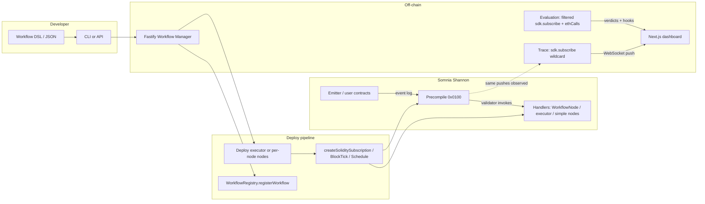

# Mesh

**Mesh** is a reactive workflow engine for teams shipping multi-contract automation on **Somnia**. You describe a workflow as a **DAG** (triggers, optional conditions, calls, and emits) in JSON; Mesh **validates and compiles** it, **deploys** `SomniaEventHandler`-based contracts on **Shannon** testnet (chain id `50312`, STT), **registers** them in an on-chain **WorkflowRegistry**, and wires **Reactivity SDK** subscriptions so validators **invoke your handlers** when logs match—no polling bot required. A **Next.js** dashboard lists workflows, streams **live trace** and **hybrid evaluation** over WebSockets, and includes a **visual workflow builder** at `/workflows/build`.

Under the hood, Mesh leans on **`@somnia-chain/reactivity`** (TypeScript SDK for subscribe, subscription CRUD, cron helpers) and **`@somnia-chain/reactivity-contracts`** (Solidity `SomniaEventHandler`). The canonical product spec is [docs/mesh_prd.md](https://github.com/samfelix03/mesh/blob/main/docs/mesh_prd.md).

---

## Important links

| Link | URL |
| ---- | --- |
| **Repository** | [github.com/samfelix03/mesh](https://github.com/samfelix03/mesh) |
| **Live app** | [mesh-somnia.vercel.app](https://mesh-somnia.vercel.app) |
| **Demo video** | *Coming soon* — shot list: [docs/demo-video-flow.md](https://github.com/samfelix03/mesh/blob/main/docs/demo-video-flow.md) |
| **Block explorer** | [Shannon explorer](https://shannon-explorer.somnia.network/) |
| **RPC** | `https://dream-rpc.somnia.network` (see [network-config.md](https://github.com/samfelix03/mesh/blob/main/docs/somnia-reactivity-docs/network-info/network-config.md)) |
| **Demo deployment pin** | [backend/contracts/deployments/shannon-demo.json](https://github.com/samfelix03/mesh/blob/main/backend/contracts/deployments/shannon-demo.json) (updated by `demo:bootstrap:shannon`) |
| **Paste-friendly UI demos (JSON)** | [workflow-demo-jsons/README.md](https://github.com/samfelix03/mesh/blob/main/workflow-demo-jsons/README.md) |

**Shannon — team demo contracts** (explorer = Blockscout-style `/address/…` as in [frontend `shannonExplorerAddressUrl`](https://github.com/samfelix03/mesh/blob/main/frontend/lib/meshConfig.ts)):

| Artifact | Role | Address (explorer) | Source |
| -------- | ---- | ------------------ | ------ |
| **WorkflowRegistry** | Discovery + lifecycle | [0x231658eDc3CF6a3CeEADf6657A1A01Fa3bC942eC](https://shannon-explorer.somnia.network/address/0x231658eDc3CF6a3CeEADf6657A1A01Fa3bC942eC) | [WorkflowRegistry.sol](https://github.com/samfelix03/mesh/blob/main/backend/contracts/src/WorkflowRegistry.sol) |
| **AuditLog** | Append-only audit (optional) | [0x41ffe131489F874B1759a2EeF5C9795AF4C9d50A](https://shannon-explorer.somnia.network/address/0x41ffe131489F874B1759a2EeF5C9795AF4C9d50A) | [AuditLog.sol](https://github.com/samfelix03/mesh/blob/main/backend/contracts/src/AuditLog.sol) |
| **Demo TriggerEmitter** | `Ping(uint256)` for demos | [0x268c2bE29D6b4e062ff979dA62931EEFF49FA1af](https://shannon-explorer.somnia.network/address/0x268c2bE29D6b4e062ff979dA62931EEFF49FA1af) | [TriggerEmitter.sol](https://github.com/samfelix03/mesh/blob/main/backend/contracts/src/demo/TriggerEmitter.sol) |
| **Demo 1 — executor** | `MeshWorkflowExecutor` (hybrid + `emit`) | [0x7d474a384e20f146bf796c5a1039e9ac6ee4661d](https://shannon-explorer.somnia.network/address/0x7d474a384e20f146bf796c5a1039e9ac6ee4661d) | [MeshWorkflowExecutor.sol](https://github.com/samfelix03/mesh/blob/main/backend/contracts/src/compiler/MeshWorkflowExecutor.sol) |
| **Demo 1 — `workflowId`** | Registry / trace filter (bytes32) | `0x49bcc797ce2d24f46c7c7daddeba076207b7a0f0117554ca7ad11929609203bc` | — |
| **Demo 1 — root subscription** | On-chain sub id | `22401` | — |
| **Demo 2 — fan-out** | 3 × `MeshSimpleStepNode` + 3 subs | See `demo02Fanout` in [shannon-demo.json](https://github.com/samfelix03/mesh/blob/main/backend/contracts/deployments/shannon-demo.json) | [MeshSimpleStepNode.sol](https://github.com/samfelix03/mesh/blob/main/backend/contracts/src/compiler/MeshSimpleStepNode.sol) |

**Deploy registry + AuditLog:** `npm run contracts:deploy:mesh:shannon` ([deploy-mesh-shannon.sh](https://github.com/samfelix03/mesh/blob/main/backend/contracts/script/deploy-mesh-shannon.sh), **~30M gas / tx**). Set `WORKFLOW_REGISTRY_ADDRESS` and **`DEMO_TRIGGER_EMITTER`** in [backend/env.example](https://github.com/samfelix03/mesh/blob/main/backend/env.example) / `.env` so `/demo` and `POST /chain/ping` stay aligned with indexed workflows.

> On Shannon you need **STT** for gas plus Somnia’s **reactivity minimum balance** for subscription owners; failed deploys usually mean top up or raise `MESH_CONTRACT_DEPLOY_GAS`.

---

## How to demo

### A. Shannon live hub (`/demo`)

Use the [hosted app](https://mesh-somnia.vercel.app).

1. Open **`/demo`** (from home, **Live demo (testnet)**).
2. Read the **Demo 1** vs **Demo 2** copy: one compiled **executor** + root sub vs **per-node fan-out** (three nodes, three subs, same `Ping` filter).
3. Click **Ping (on-chain)** — the UI calls **`POST /chain/ping`**, which sends `TriggerEmitter.ping` from the server wallet.
4. Watch **Off-chain evaluation** (Demo 1 hybrid, requires `EVALUATION_ENGINE=1`) and **Live trace** (`TRACE_ENGINE=1`): PASS/FAIL lines and raw JSON as events land.
5. Use **Open full monitor →** for registry metadata, DSL snapshot, and filtered WebSocket trace; **All workflows** → **`/workflows`** for the full list.

Click-by-click narrative: [docs/demo-ui-walkthrough.md](https://github.com/samfelix03/mesh/blob/main/docs/demo-ui-walkthrough.md). Shannon showcase: [docs/demo-showcase-shannon.md](https://github.com/samfelix03/mesh/blob/main/docs/demo-showcase-shannon.md).

### B. Import a workflow in the builder (`/workflows/build`)

1. Go to **`/workflows/build`** (e.g. **Create workflow** from the workflows list).
2. In the **Import JSON** panel, paste a full **`WorkflowDefinition`**. Use the small **Ping** demos in [`workflow-demo-jsons/`](https://github.com/samfelix03/mesh/tree/main/workflow-demo-jsons) (replace placeholder emitter with yours — see [workflow-demo-jsons/README.md](https://github.com/samfelix03/mesh/blob/main/workflow-demo-jsons/README.md)):
   - [mesh-ui-demo-ping-single-noop.workflow.json](https://github.com/samfelix03/mesh/blob/main/workflow-demo-jsons/mesh-ui-demo-ping-single-noop.workflow.json) — one step, **noop** (trace smoke test).
   - [mesh-ui-demo-ping-two-step.workflow.json](https://github.com/samfelix03/mesh/blob/main/workflow-demo-jsons/mesh-ui-demo-ping-two-step.workflow.json) — two-step executor DAG (two `WorkflowStepExecuted` lines).
3. Load it into the canvas (the builder maps JSON ↔ graph).
4. Inspect or edit nodes, then use **Validate** / **Compile** / **Deploy** as exposed in the UI (same API as the CLI).

Full hybrid + fan-out templates for deploy/scripts live under [backend/templates/](https://github.com/samfelix03/mesh/tree/main/backend/templates).

### C. Optional operator paths

- **CLI:** `mesh` — `validate`, `compile`, `deploy-dsl` (see **Quick start** below).
- **Explorer:** addresses and txs from [shannon-demo.json](https://github.com/samfelix03/mesh/blob/main/backend/contracts/deployments/shannon-demo.json).

---

## The problem

Cross-protocol coordination on a vanilla EVM is still **pull-based**: you run indexers or bots that **poll** RPC, watch logs, then fire follow-up transactions. The moment you separate “I saw an event” from “I read state,” you inherit **races**—the `eth_call` you make after the log might reflect a **different block** or a **reorged** view than the event you reacted to. Teams paper over this with retries, idempotency keys, and centralized automation that must stay online and funded.

**Concrete scenario:** A **treasury operator** must move liquidity when a **governance timelock** emits `QueueTransaction`, but only if the **vault’s** on-chain utilization is still above a threshold **in the same execution context** as that emit. Without reactivity, their script sees the log, then calls the vault—two round trips, two contexts, easy to misread during congestion or to get wrong under load. They either **ship slowly** (manual checks) or **ship fragile automation** (bots + alert fatigue).

---

## Our solution

**Somnia Reactivity** is the substrate: the network can **push** matching logs together with **bundled view results** (`ethCalls` / `simulationResults`) over WebSocket, and **invoke Solidity handlers** registered via the **reactivity precompile**—so automation can be **validator-scheduled**, **per-event**, and **context-consistent**. That is what makes “when B happens, do A with the **right** state snapshot” a first-class chain feature instead of a bot contract.

**Mesh** is the product layer on top: a **Workflow Manager** API, **DAG validation**, a **v1 compiler** to `MeshWorkflowExecutor` or **per-node fan-out**, **pause/delete** that cancels subscriptions, **wildcard trace** and **hybrid evaluation** streams for the dashboard, **`emit`** steps for indexer-visible `LOG1`s, and a **visual builder** so non-Solidity-first teammates can still reason about the graph. Somnia is not an implementation detail here—it is the **reason** Mesh’s guarantees are achievable without a proprietary relay network.

---

## How Mesh works (end-to-end)



1. **Define** workflows as JSON: **`POST /workflows/validate`** (optional `forCompiler` / `forHybrid`), **`POST /workflows/compile`** for a dry-run plan, **`POST /workflows/from-definition`** to deploy (**executor** or **`perNodeFanout`**). The Shannon **demo bootstrap** still deploys fixed demo contracts for a fast UI path.
2. **Deploy** contracts that inherit **`SomniaEventHandler`** via [WorkflowNode.sol](https://github.com/samfelix03/mesh/blob/main/backend/contracts/src/WorkflowNode.sol): compiled DAGs use [MeshWorkflowExecutor.sol](https://github.com/samfelix03/mesh/blob/main/backend/contracts/src/compiler/MeshWorkflowExecutor.sol); fan-out mode uses one [MeshSimpleStepNode.sol](https://github.com/samfelix03/mesh/blob/main/backend/contracts/src/compiler/MeshSimpleStepNode.sol) per step.
3. **Subscribe** through the SDK ([createSubscriptionForRootTrigger](https://github.com/samfelix03/mesh/blob/main/backend/src/compiler/subscriptionFromTrigger.ts)): **`createSoliditySubscription`** for `event` roots, **`createOnchainBlockTickSubscription`** for `cron:block`, **`scheduleOnchainCronJob`** for `cron:timestamp`—all targeting precompile **`0x0100`** (see [precompile.ts](https://github.com/samfelix03/mesh/blob/main/backend/src/abis/precompile.ts)).
4. **Register** executor or node addresses and subscription ids on [WorkflowRegistry.sol](https://github.com/samfelix03/mesh/blob/main/backend/contracts/src/WorkflowRegistry.sol) for discovery, pause/delete, and UI joins.
5. **Observe**: handlers emit **`WorkflowStepExecuted`** / **`WorkflowNoOp`**; **`TRACE_ENGINE`** runs a **wildcard** `sdk.subscribe` (stdout and/or [traceBroadcaster.ts](https://github.com/samfelix03/mesh/blob/main/backend/src/traceBroadcaster.ts) → **`WS /ws/trace`**). **Hybrid** roots use a **filtered** `sdk.subscribe` with **`ethCalls`** in [evaluationRuntime.ts](https://github.com/samfelix03/mesh/blob/main/backend/src/evaluationRuntime.ts) → condition evaluation, optional webhooks, **`WS /ws/evaluation`**.

---

## Mesh × Somnia

Canonical feature map. Every row is implemented in this repo; **Line** links to the anchor on `main`.

| Somnia reactivity capability | Line(s) | What Mesh does with it |
| ---------------------------- | ------- | ---------------------- |
| **`SomniaEventHandler` base contract** | [WorkflowNode.sol:9](https://github.com/samfelix03/mesh/blob/main/backend/contracts/src/WorkflowNode.sol#L9) | All Mesh step contracts inherit Somnia’s handler type. |
| **`_onEvent` override (compiled executor)** | [MeshWorkflowExecutor.sol:58](https://github.com/samfelix03/mesh/blob/main/backend/contracts/src/compiler/MeshWorkflowExecutor.sol#L58) | Root subscription invokes the executor; it runs the compiled DAG (`call` / `emit` / noop, fan-out to child indices). |
| **`_onEvent` override (per-node)** | [MeshSimpleStepNode.sol:41](https://github.com/samfelix03/mesh/blob/main/backend/contracts/src/compiler/MeshSimpleStepNode.sol#L41) | Fan-out deploy: each node’s handler runs its single step. |
| **`_onEvent` override (demo node)** | [MeshEventWorkflowNode.sol:15](https://github.com/samfelix03/mesh/blob/main/backend/contracts/src/demo/MeshEventWorkflowNode.sol#L15) | Demo pipeline touches [ReactionSink.sol](https://github.com/samfelix03/mesh/blob/main/backend/contracts/src/demo/ReactionSink.sol) and emits trace events. |
| **`createSoliditySubscription`** | [subscriptionFromTrigger.ts:40](https://github.com/samfelix03/mesh/blob/main/backend/src/compiler/subscriptionFromTrigger.ts#L40), [deployDemoWorkflow.ts:152](https://github.com/samfelix03/mesh/blob/main/backend/src/services/deployDemoWorkflow.ts#L152), [deployCompiledWorkflow.ts:92](https://github.com/samfelix03/mesh/blob/main/backend/src/services/deployCompiledWorkflow.ts#L92), [deployPerNodeFanout.ts:97](https://github.com/samfelix03/mesh/blob/main/backend/src/services/deployPerNodeFanout.ts#L97) | Binds emitter + topic filter → handler; records subscription id on the registry. |
| **`createOnchainBlockTickSubscription`** | [subscriptionFromTrigger.ts:48](https://github.com/samfelix03/mesh/blob/main/backend/src/compiler/subscriptionFromTrigger.ts#L48) | DSL `cron:block` → `BlockTick` system event path. |
| **`scheduleOnchainCronJob`** | [subscriptionFromTrigger.ts:55](https://github.com/samfelix03/mesh/blob/main/backend/src/compiler/subscriptionFromTrigger.ts#L55) | DSL `cron:timestamp` → one-shot `Schedule`. |
| **`isGuaranteed` / `isCoalesced` + fee fields** | [subscriptionFromTrigger.ts:14–21](https://github.com/samfelix03/mesh/blob/main/backend/src/compiler/subscriptionFromTrigger.ts#L14-L21), [deployDemoWorkflow.ts:156–162](https://github.com/samfelix03/mesh/blob/main/backend/src/services/deployDemoWorkflow.ts#L156-L162) | PRD defaults: guaranteed delivery, not coalesced; `parseGwei` aligns with Somnia gas docs. |
| **Precompile address `0x0100` + `SubscriptionCreated` logs** | [precompile.ts:4–6](https://github.com/samfelix03/mesh/blob/main/backend/src/abis/precompile.ts#L4-L6), [precompile.ts:58+](https://github.com/samfelix03/mesh/blob/main/backend/src/abis/precompile.ts#L58) | Parse subscription id from subscribe receipts after SDK txs. |
| **`decodeEventLog` on precompile receipts** | [precompile.ts:81–88](https://github.com/samfelix03/mesh/blob/main/backend/src/abis/precompile.ts#L81-L88) | Reads `SubscriptionCreated` tuple when viem’s topic0 matches the ABI; falls back to indexed `subscriptionId` (topic 2). |
| **Subscription owner minimum native balance** | [reactivityBalance.ts:3–16](https://github.com/samfelix03/mesh/blob/main/backend/src/services/reactivityBalance.ts#L3-L16); callers e.g. [deployCompiledWorkflow.ts:55](https://github.com/samfelix03/mesh/blob/main/backend/src/services/deployCompiledWorkflow.ts#L55), [deployDemoWorkflow.ts:78](https://github.com/samfelix03/mesh/blob/main/backend/src/services/deployDemoWorkflow.ts#L78) | Enforces Shannon STT floor before creating subs. |
| **`cancelSoliditySubscription`** | [workflowLifecycle.ts:55](https://github.com/samfelix03/mesh/blob/main/backend/src/services/workflowLifecycle.ts#L55) | Pause/delete: tear down each non-zero subscription id before registry updates. |
| **`getSubscriptionInfo`** | [workflows.ts:367](https://github.com/samfelix03/mesh/blob/main/backend/src/routes/workflows.ts#L367) | `GET /workflows/:id/subscriptions/:subId` for ops / dashboard. |
| **`SDK` construction (HTTP + WS clients)** | [sdk.ts:12](https://github.com/samfelix03/mesh/blob/main/backend/src/sdk.ts#L12), [sdk.ts:68–80](https://github.com/samfelix03/mesh/blob/main/backend/src/sdk.ts#L68-L80) | Wallet + public HTTP for txs; WebSocket public client for `sdk.subscribe`. |
| **Off-chain `sdk.subscribe` (wildcard trace)** | [traceEngine.ts:12](https://github.com/samfelix03/mesh/blob/main/backend/src/traceEngine.ts#L12); [traceBroadcaster.ts:40](https://github.com/samfelix03/mesh/blob/main/backend/src/traceBroadcaster.ts#L40); [index.ts:24](https://github.com/samfelix03/mesh/blob/main/backend/src/index.ts#L24) | Wildcard stream; UI filter on `topics[1]` as `workflowId` in [traceBroadcaster.ts:47–49](https://github.com/samfelix03/mesh/blob/main/backend/src/traceBroadcaster.ts#L47-L49). |
| **Off-chain `sdk.subscribe` + `ethCalls` + filters (hybrid)** | [evaluationRuntime.ts:35–46](https://github.com/samfelix03/mesh/blob/main/backend/src/evaluationRuntime.ts#L35-L46) | Root `ethCalls` and emitter/topic overrides for per-workflow evaluation streams. |
| **`simulationResults[]` + `topics` in push payload** | [evaluationRuntime.ts:47–62](https://github.com/samfelix03/mesh/blob/main/backend/src/evaluationRuntime.ts#L47-L62) | Feeds condition evaluation and optional `evaluationHooks` with same-block view data. |
| **Condition: uint256 compare on simulation slot** | [evaluateCondition.ts:47–88](https://github.com/samfelix03/mesh/blob/main/backend/src/evaluateCondition.ts#L47-L88) | Decodes `simulationResults[i]` as uint256 vs DSL threshold. |
| **`conditionTree` (AND / OR)** | [evaluateCondition.ts:102–114](https://github.com/samfelix03/mesh/blob/main/backend/src/evaluateCondition.ts#L102-L114), [evaluateCondition.ts:117–121](https://github.com/samfelix03/mesh/blob/main/backend/src/evaluateCondition.ts#L117-L121) | Composable predicates on the same push payload. |
| **Simulation hex decode helper** | [evaluateCondition.ts:4–14](https://github.com/samfelix03/mesh/blob/main/backend/src/evaluateCondition.ts#L4-L14) | Normalizes Somnia-returned hex to bigint for comparisons. |
| **Forge tests ↔ precompile types** | e.g. [MeshWorkflowExecutor.t.sol:6](https://github.com/samfelix03/mesh/blob/main/backend/contracts/test/MeshWorkflowExecutor.t.sol#L6), [MeshSimpleStepNode.t.sol:5](https://github.com/samfelix03/mesh/blob/main/backend/contracts/test/MeshSimpleStepNode.t.sol#L5) | `ISomniaReactivityPrecompile` / `SomniaExtensions` imports for subscription testing. |

**Network:** [network-config.md](https://github.com/samfelix03/mesh/blob/main/docs/somnia-reactivity-docs/network-info/network-config.md). **Gas / fees:** [gas-config.md](https://github.com/samfelix03/mesh/blob/main/docs/somnia-reactivity-docs/gas-config.md).

### On-chain handlers: `SomniaEventHandler`

Validators invoke your contract when a subscription matches. Mesh standardizes that through an abstract **`WorkflowNode`** that inherits Somnia’s **`SomniaEventHandler`** and defines trace events the off-chain engine can watch for.

Source: [WorkflowNode.sol](https://github.com/samfelix03/mesh/blob/main/backend/contracts/src/WorkflowNode.sol) (lines [4–14](https://github.com/samfelix03/mesh/blob/main/backend/contracts/src/WorkflowNode.sol#L4-L14)).

```solidity
import { SomniaEventHandler } from "@somnia-chain/reactivity-contracts/contracts/SomniaEventHandler.sol";

abstract contract WorkflowNode is SomniaEventHandler {
    event WorkflowStepExecuted(bytes32 indexed workflowId, bytes32 indexed nodeId, uint256 timestamp);
    event WorkflowNoOp(bytes32 indexed workflowId, bytes32 indexed nodeId, string reason);
    // ...
}
```

The compiled **executor** overrides **`_onEvent`** and runs the whole DAG from step `0`. Source: [MeshWorkflowExecutor.sol#L58-L60](https://github.com/samfelix03/mesh/blob/main/backend/contracts/src/compiler/MeshWorkflowExecutor.sol#L58-L60).

```solidity
function _onEvent(address emitter, bytes32[] calldata eventTopics, bytes calldata data) internal override {
    _runStep(0, emitter, eventTopics, data);
}
```

### Root triggers: SDK subscriptions and delivery semantics

**`createSubscriptionForRootTrigger`** maps the DSL root (`event`, `cron:block`, `cron:timestamp`) to the right Somnia SDK call and applies Mesh’s default **guaranteed, non-coalesced** subscription shape plus fee fields from env / DSL. Source: [subscriptionFromTrigger.ts](https://github.com/samfelix03/mesh/blob/main/backend/src/compiler/subscriptionFromTrigger.ts) ([lines 14–21](https://github.com/samfelix03/mesh/blob/main/backend/src/compiler/subscriptionFromTrigger.ts#L14-L21), [39–58](https://github.com/samfelix03/mesh/blob/main/backend/src/compiler/subscriptionFromTrigger.ts#L39-L58)).

```typescript
export function subscriptionGas(gas?: GasConfig): SubscriptionGas {
  return {
    priorityFeePerGas: gas?.priorityFeePerGas ?? parseGwei(process.env.MESH_PRIORITY_FEE_GWEI ?? "2"),
    maxFeePerGas: gas?.maxFeePerGas ?? parseGwei(process.env.MESH_MAX_FEE_GWEI ?? "10"),
    gasLimit: gas?.gasLimit ?? (process.env.MESH_SUBSCRIPTION_GAS_LIMIT ? BigInt(process.env.MESH_SUBSCRIPTION_GAS_LIMIT) : 2_000_000n),
    isGuaranteed: true,
    isCoalesced: false,
  };
}

if (trigger.type === "event") {
  return sdk.createSoliditySubscription({
    ...base,
    emitter: trigger.emitter,
    eventTopics: [trigger.eventTopic0],
  });
}
```

### Precompile receipts: subscription id

Subscribe transactions emit logs from the reactivity **precompile `0x0100`**. Mesh filters those logs and parses **`SubscriptionCreated`** so deploy code can store the numeric id on the registry. Source: [precompile.ts#L4-L6](https://github.com/samfelix03/mesh/blob/main/backend/src/abis/precompile.ts#L4-L6), [parseSubscriptionIdFromReceipt](https://github.com/samfelix03/mesh/blob/main/backend/src/abis/precompile.ts#L58).

```typescript
export const SOMNIA_REACTIVITY_PRECOMPILE = getAddress(
  "0x0000000000000000000000000000000000000100",
) as `0x${string}`;
```

### Off-chain trace: wildcard `sdk.subscribe`

The **trace engine** opens a **wildcard** WebSocket subscription (no `ethCalls`) so every matching log— including **`WorkflowStepExecuted`** — reaches the API and browser. Source: [traceEngine.ts#L7-L18](https://github.com/samfelix03/mesh/blob/main/backend/src/traceEngine.ts#L7-L18).

```typescript
export async function startTraceSubscription(
  sdk: SDK,
  onData: (data: SubscriptionCallback) => void,
  onError?: (err: Error) => void,
) {
  return sdk.subscribe({
    ethCalls: [],
    onlyPushChanges: false,
    onData,
    onError,
  });
}
```

**`traceBroadcaster`** optionally filters pushes by **`workflowId`** using `topics[1]` before sending to **`/ws/trace`** clients. Source: [traceBroadcaster.ts#L46-L50](https://github.com/samfelix03/mesh/blob/main/backend/src/traceBroadcaster.ts#L46-L50).

```typescript
if (c.workflowIdFilter) {
  const topics = data.result?.topics;
  if (!Array.isArray(topics) || topics.length < 2) continue;
  if (String(topics[1]).toLowerCase() !== c.workflowIdFilter) continue;
}
```

### Hybrid evaluation: `ethCalls`, `simulationResults`, conditions

For **hybrid** workflows, the evaluation runtime subscribes with **root `ethCalls`** and emitter/topic filters so each push carries **`simulationResults`** aligned with the trigger. **`evaluateRootCondition`** (including **`conditionTree`**) runs on that payload. Source: [evaluationRuntime.ts#L35-L62](https://github.com/samfelix03/mesh/blob/main/backend/src/evaluationRuntime.ts#L35-L62).

```typescript
const ethCalls = (root.ethCalls ?? []).map((spec) => ({
  to: getAddress(spec.to),
  data: spec.data === "0x" || spec.data === undefined ? undefined : (spec.data as Hex),
}));

const sub = await sdk.subscribe({
  ethCalls,
  eventContractSources: [getAddress(root.trigger.emitter)],
  topicOverrides: [root.trigger.eventTopic0],
  onData: async (cb) => {
    const sim = (cb.result?.simulationResults ?? []) as Hex[];
    const verdict = evaluateRootCondition(root, sim);
    // broadcast + optional evaluationHooks…
  },
});
```

### Subscription lifecycle and owner balance

**Pause/delete** cancels each on-chain subscription id via the SDK before mutating registry state. Source: [workflowLifecycle.ts#L48-L58](https://github.com/samfelix03/mesh/blob/main/backend/src/services/workflowLifecycle.ts#L48-L58).

```typescript
for (const id of subscriptionIds) {
  if (id === 0n) continue;
  const tx = await sdk.cancelSoliditySubscription(id);
  // ...
}
```

Before creating subscriptions, deploy paths assert the owner meets Somnia’s **minimum native balance** (32 STT on Shannon). Source: [reactivityBalance.ts#L3-L16](https://github.com/samfelix03/mesh/blob/main/backend/src/services/reactivityBalance.ts#L3-L16).

```typescript
export const REACTIVITY_MIN_OWNER_BALANCE_WEI = 32n * 10n ** 18n;

export async function assertReactivityOwnerBalance(
  publicClient: PublicClient,
  owner: Address,
): Promise<void> {
  const balance = await publicClient.getBalance({ address: owner });
  if (balance < REACTIVITY_MIN_OWNER_BALANCE_WEI) {
    throw new Error(/* … */);
  }
}
```

---

## Repository layout

| Path | Role |
| ---- | ---- |
| [backend/](https://github.com/samfelix03/mesh/tree/main/backend) | **Self-contained deploy unit:** Fastify API, Reactivity SDK wiring, DSL + validation, workflow index (`data/workflows-index.json`), WebSocket `/ws/trace`, scripts (`e2e:shannon`, `deploy:registry`, `mesh` CLI). Includes **contracts** (Foundry), **templates** (full demo JSON), etc. |
| [frontend/](https://github.com/samfelix03/mesh/tree/main/frontend) | Next.js dashboard: workflow list, detail + live trace, **visual workflow builder** (`/workflows/build`). |
| [workflow-demo-jsons/](https://github.com/samfelix03/mesh/tree/main/workflow-demo-jsons) | Small **Ping** workflow JSON files for paste/import in the UI (see README there). |
| [docs/](https://github.com/samfelix03/mesh/tree/main/docs) | PRD, feasibility, imported Somnia / Foundry docs. |

---

## Implemented today vs roadmap

| Area | Status |
| ---- | ------ |
| Registry + trace base contracts | Done |
| Demo Shannon pipeline (deploy → subscribe → register → ping) | Done (requires funding per Somnia rules) |
| Workflow Manager REST API | Done (`/workflows`, `/chain/*`, `/health`) |
| Pause / delete (cancel subs + registry) | Done |
| Workflow list (indexed file) | Done |
| Wildcard trace WebSocket to browsers | Done (`/ws/trace`) |
| DSL types + DAG validation API | Done (`POST /workflows/validate`, `forCompiler: true` for compiler rules) |
| v1 compiler (executor bytecode + root subscription) | Done — [MeshWorkflowExecutor.sol](https://github.com/samfelix03/mesh/blob/main/backend/contracts/src/compiler/MeshWorkflowExecutor.sol), [compileWorkflow.ts](https://github.com/samfelix03/mesh/blob/main/backend/src/compiler/compileWorkflow.ts), `POST /workflows/compile`, `POST /workflows/from-definition` |
| CLI `mesh` | Done — includes `validate --compiler`, `compile`, `deploy-dsl` |
| Dashboard | Done — list + detail, stored DSL (compiled deploys), trace decode + **WS `workflowId` filter**, **visual builder** at `/workflows/build` ([workflow-builder.md](https://github.com/samfelix03/mesh/blob/main/docs/workflow-builder.md)) |
| `emit` in compiled executor (`LOG1` + `WorkflowStepExecuted`) | Done — [compiler-emit.md](https://github.com/samfelix03/mesh/blob/main/docs/compiler-emit.md) |
| **Hybrid** root `ethCalls` + off-chain **`condition` / `conditionTree`** + optional **`evaluationHooks.onPass`** (webhook; raw tx gated) | Done — [evaluation-engine.md](https://github.com/samfelix03/mesh/blob/main/docs/evaluation-engine.md), `EVALUATION_ENGINE=1`, index watcher + optional `POST /admin/evaluation/sync`, `WS /ws/evaluation` |
| Per-node deploy (N × `MeshSimpleStepNode` + N subs) | Done — `deployMode: "perNodeFanout"`, CLI `deploy-dsl --fanout`; see [per-node-deploy.md](https://github.com/samfelix03/mesh/blob/main/docs/per-node-deploy.md) |

---

## Compiler (v1)

The compiler turns a **validated** [WorkflowDefinition](https://github.com/samfelix03/mesh/blob/main/backend/src/dsl/types.ts) into:

1. **`MeshWorkflowExecutor`** — one contract per workflow. Step `0` is the reactive entry (matches the **root** node’s trigger). Each step can **`call`**, **`emit`** an anonymous `LOG1` (standard event `topic0` + payload bytes), or **`noop`**, then branch to child indices. The executor emits `WorkflowStepExecuted` per step (with per-step `stepNodeId` for trace correlation).
2. **One on-chain subscription** on the root trigger only — `event` (emitter + `eventTopic0`), `cron:block` (`BlockTick` via precompile emitter `0x0100`), or `cron:timestamp` (`Schedule`). Fan-out in the graph is **in-contract** (executor branches), not multiple root subscriptions.
3. **Registry** — same `WorkflowRegistry.registerWorkflow` shape as the demo: the indexed `workflowNode` is the **executor** address; `sink` is `0x0` for compiled rows.

**v1 limits** (on-chain): [validateForCompiler.ts](https://github.com/samfelix03/mesh/blob/main/backend/src/compiler/validateForCompiler.ts) — single root, reachable DAG, **`emit`**, no `condition` / `ethCalls` *in bytecode* (those fields are **stripped** before compile). **Hybrid:** root-only `ethCalls` + optional `condition` for **off-chain** evaluation (see below); graph size capped (≤255 steps, `uint8` edges).

Canonical Shannon / compiler demos: [demo-01-hybrid-executor.workflow.json](https://github.com/samfelix03/mesh/blob/main/backend/templates/demo-01-hybrid-executor.workflow.json) (hybrid + emit), [demo-02-fanout-pipeline.workflow.json](https://github.com/samfelix03/mesh/blob/main/backend/templates/demo-02-fanout-pipeline.workflow.json) (fan-out). **UI paste demos:** [workflow-demo-jsons/](https://github.com/samfelix03/mesh/tree/main/workflow-demo-jsons).

**API**

- `POST /workflows/validate` — `{ "definition", "forCompiler"?: true, "forHybrid"?: true }`.
- `POST /workflows/compile` — dry-run plan JSON (includes `hybridEvaluation` when applicable).
- `POST /workflows/from-definition` — deploy executor + subscribe + register; stores full DSL + `hybridEvaluation` flag.

**CLI** (from `backend/`, API must be running):

```bash
npm run mesh -- validate --file workflows/demo-01-hybrid-executor.workflow.json --hybrid --compiler
npm run mesh -- compile --file workflows/demo-01-hybrid-executor.workflow.json
npm run mesh -- deploy-dsl --file workflows/demo-01-hybrid-executor.workflow.json
npm run mesh -- deploy-dsl --file workflows/demo-02-fanout-pipeline.workflow.json --fanout
```

`mesh init` copies both demo templates into `workflows/` from [backend/templates/](https://github.com/samfelix03/mesh/tree/main/backend/templates).

---

## Quick start

### 1. Contracts

```bash
cd backend/contracts && npm install && forge build && forge test
```

### 2. Backend

```bash
cd backend && npm install && cp env.example .env
# Set PRIVATE_KEY, WORKFLOW_REGISTRY_ADDRESS, RPC URLs as needed
npm run dev
```

Key routes:

- `HEAD /health` — liveness (200, no body)
- `GET /workflows` — indexed deployments (omit `definition` by default; use `?full=true` to include stored DSL snapshots)
- `POST /workflows` — `{ "workflowStringId": "..." }` demo deploy
- `POST /workflows/validate` — `{ "definition", "forCompiler"?, "forHybrid"? }`
- `POST /workflows/compile` — `{ "definition", "deployMode"?: "executor" | "perNodeFanout" }` (plan JSON; 400 on validation error)
- `POST /workflows/from-definition` — `{ "definition", "deployMode"?: ... }` (deploy compiled workflow or per-node fan-out)
- `POST /chain/ping` — `{ "emitterAddress", "seq" }` — submits `TriggerEmitter.ping` (for **/demo** UI)
- `GET /workflows/:id` — on-chain registry view + optional `indexMeta` (name, kind, **`deployMode`**, hybrid flag, optional multi-sub / node lists) when indexed
- `POST /admin/evaluation/sync` — when `MESH_ADMIN_TOKEN` is set: `Authorization: Bearer …` to resync hybrid evaluation subscriptions vs the index
- `POST /workflows/:id/pause`, `DELETE /workflows/:id`
- `WS /ws/trace` — fan-out of wildcard `sdk.subscribe` payloads; optional **`?workflowId=0x…`** (bytes32) filters to that workflow’s Mesh trace events
- `WS /ws/evaluation` — hybrid **evaluation verdicts** (`EVALUATION_ENGINE=1`); optional **`?workflowId=0x…`**

Set `FRONTEND_ORIGIN=http://localhost:3000` if you need strict CORS. `TRACE_ENGINE=1` logs trace lines to stdout. **`EVALUATION_ENGINE=1`** starts per-workflow subscribe + condition evaluation + index file watcher (see [evaluation-engine.md](https://github.com/samfelix03/mesh/blob/main/docs/evaluation-engine.md)). Optional: **`MESH_ADMIN_TOKEN`**, **`MESH_ALLOW_EVAL_RAW_TX=1`** (see [env.example](https://github.com/samfelix03/mesh/blob/main/backend/env.example)).

### 3. CLI (from `backend/`)

```bash
npm run mesh -- init
# writes demo-01 + demo-02 JSON under workflows/
npm run mesh -- validate --file workflows/demo-01-hybrid-executor.workflow.json --hybrid --compiler
npm run mesh -- compile --file workflows/demo-01-hybrid-executor.workflow.json
npm run mesh -- deploy-dsl --file workflows/demo-01-hybrid-executor.workflow.json
npm run mesh -- deploy-dsl --file workflows/demo-02-fanout-pipeline.workflow.json --fanout
npm run mesh -- deploy --id my-demo-flow
npm run mesh -- list
```

### 4. Frontend

```bash
cd frontend && cp .env.example .env && npm install && npm run dev
```

Open [http://localhost:3000](http://localhost:3000) → **`/demo`** for the guided Shannon testnet experience, **Workflows**, or **Create workflow** (`/workflows/build`).

### 5. Shannon E2E script

```bash
cd backend && npm run e2e:shannon
# Optional: deploy from backend/templates/demo-01-hybrid-executor.workflow.json (set E2E_EMITTER to real TriggerEmitter)
npm run e2e:compiled
```

Requires registry + funded key per Somnia reactivity rules (see [reactivityBalance.ts](https://github.com/samfelix03/mesh/blob/main/backend/src/services/reactivityBalance.ts)) — **≥ 32 STT** for on-chain subscriptions.

---

## Monorepo build

From the repository root (requires [Foundry](https://book.getfoundry.sh/) on `PATH`):

```bash
npm run contracts:build   # forge build in backend/contracts/
npm run build:all         # contracts + backend tsc + frontend next build
```

**Contract tests:** Foundry tests live under [backend/contracts/test/](https://github.com/samfelix03/mesh/tree/main/backend/contracts/test) (`WorkflowRegistry`, `MeshWorkflowExecutor`, `AuditLog`, `MeshSimpleStepNode`). The [TestWorkflowNode](https://github.com/samfelix03/mesh/blob/main/backend/contracts/test/mocks/TestWorkflowNode.sol) mock is required by registry tests — do not remove. If Forge warns about missing stale artifacts, run `cd backend/contracts && forge clean && forge build`.

## Further reading

- [docs/evaluation-engine.md](https://github.com/samfelix03/mesh/blob/main/docs/evaluation-engine.md) — **hybrid `ethCalls` + condition**, `EVALUATION_ENGINE`, `/ws/evaluation`
- [docs/per-node-deploy.md](https://github.com/samfelix03/mesh/blob/main/docs/per-node-deploy.md) — **per-node fan-out** (`MeshSimpleStepNode`, `deployMode`, CLI `--fanout`)
- [docs/dashboard-and-trace.md](https://github.com/samfelix03/mesh/blob/main/docs/dashboard-and-trace.md) — index file, `GET /workflows`, trace WebSocket filter, UI
- [docs/workflow-builder.md](https://github.com/samfelix03/mesh/blob/main/docs/workflow-builder.md) — **visual DAG builder** (`/workflows/build`), graph→JSON, API actions
- [docs/compiler-emit.md](https://github.com/samfelix03/mesh/blob/main/docs/compiler-emit.md) — **`emit` actions: topic0, payload, limits, API**
- [docs/current-state-and-next.md](https://github.com/samfelix03/mesh/blob/main/docs/current-state-and-next.md) — **inventory of what is built vs PRD, and prioritized next steps**
- [docs/demo-video-flow.md](https://github.com/samfelix03/mesh/blob/main/docs/demo-video-flow.md) — **shot list for a full product demo video**
- [docs/demo-ui-walkthrough.md](https://github.com/samfelix03/mesh/blob/main/docs/demo-ui-walkthrough.md) — **beginner UI tour (every click) + pitch example**
- [docs/mesh_prd.md](https://github.com/samfelix03/mesh/blob/main/docs/mesh_prd.md) — full PRD
- [docs/feasibility.md](https://github.com/samfelix03/mesh/blob/main/docs/feasibility.md) — feasibility notes
- [backend/contracts/README.md](https://github.com/samfelix03/mesh/blob/main/backend/contracts/README.md) — contract-specific deploy commands
- Somnia reactivity docs in-repo: [docs/somnia-reactivity-docs/](https://github.com/samfelix03/mesh/tree/main/docs/somnia-reactivity-docs)

---

## Conclusion

Mesh is **Somnia-native automation**: it turns cross-contract reactions from a brittle stack of bots and RPC races into **declarative workflows**—validated, compiled, subscribed, and **observable** in one place. The chain’s reactivity layer supplies the hard part (consistent pushes, on-chain handlers, bundled view data); Mesh supplies the **team-facing** surface (DSL, registry, API, dashboard, builder).

